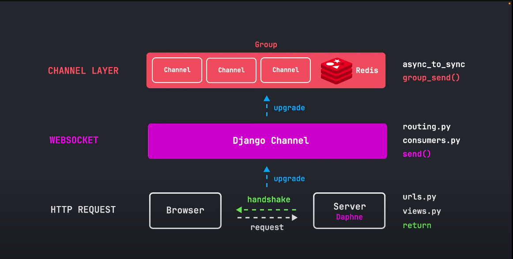

# Django Realtime Chat
- [Django Realtime Chat](#django-realtime-chat)
  - [Concepts](#concepts)
    - [Synchronous Web Servers (WSGI)](#synchronous-web-servers-wsgi)
    - [Asynchronous Web Servers (ASGI)](#asynchronous-web-servers-asgi)
    - [WebSockets](#websockets)
      - [Key Concepts of WebSockets](#key-concepts-of-websockets)
      - [Use Cases for WebSockets](#use-cases-for-websockets)
      - [Comparison with Other Technologies](#comparison-with-other-technologies)
    - [Under the Hood of Our Project](#under-the-hood-of-our-project)
    - [Daphne](#daphne)
    - [Routing](#routing)
      - [Key Points about Routing:](#key-points-about-routing)
      - [Example of Routing:](#example-of-routing)
    - [Consumers](#consumers)
      - [Key Points about Consumers:](#key-points-about-consumers)
      - [Example of a Consumer:](#example-of-a-consumer)
      - [Summary](#summary)
    - [Channels vs Channel Layers](#channels-vs-channel-layers)
      - [Channels](#channels)
        - [Key Points about Channels:](#key-points-about-channels)
      - [Channel Layers](#channel-layers)
        - [Key Points about Channel Layers:](#key-points-about-channel-layers)
      - [Summary of Differences](#summary-of-differences)
      - [Example Scenario](#example-scenario)
    - [Tracking Online People in Channels Layer](#tracking-online-people-in-channels-layer)


**Link for the starter code:** [GitHub](https://github.com/andyjud/django-starter)

## Concepts
### Synchronous Web Servers (WSGI)
WSGI is a specification that defines a simple and universal interface between web servers and Python web applications or frameworks. It is designed for synchronous applications, meaning that each request is handled one at a time. Here are some key points about WSGI:

Blocking I/O: In a WSGI application, when a request is being processed, the server waits (blocks) until the request is fully handled before moving on to the next request. This can lead to inefficiencies, especially when dealing with I/O-bound operations (like database queries or network calls).

Threading/Multiprocessing: To handle multiple requests simultaneously, WSGI servers often use threading or multiprocessing. Each request can be handled in a separate thread or process, but this can lead to increased memory usage and complexity.

Django Compatibility: Traditional Django applications are built on WSGI. This means that they are synchronous by default, and the request/response cycle is handled in a blocking manner.

Examples of WSGI Servers: Common WSGI servers include Gunicorn, uWSGI, and the built-in Django development server.

### Asynchronous Web Servers (ASGI)
ASGI is a newer specification that extends the capabilities of WSGI to support asynchronous programming. It is designed for handling both synchronous and asynchronous applications. Here are some key points about ASGI:

Non-blocking I/O: ASGI allows for non-blocking I/O operations, meaning that while one request is waiting for an I/O operation to complete, the server can handle other requests. This is particularly useful for applications that need to handle a large number of concurrent connections, such as WebSocket connections or long-polling requests.

Concurrency: ASGI supports concurrency natively, allowing for more efficient use of resources. It can handle multiple requests in a single thread using asynchronous programming techniques (like async and await in Python).

Django Compatibility: Starting from Django 3.1, Django introduced support for ASGI, allowing developers to write asynchronous views and use asynchronous features. This means that you can create Django applications that can handle both synchronous and asynchronous requests.

Examples of ASGI Servers: Common ASGI servers include Daphne, Uvicorn, and Hypercorn.

### WebSockets 
They are a protocol that enables full-duplex communication channels over a single TCP connection. They are designed to facilitate real-time communication between a client (usually a web browser) and a server. Here’s a detailed explanation of the concept of WebSockets:

#### Key Concepts of WebSockets

1. **Full-Duplex Communication**:
   - Unlike traditional HTTP requests, which are unidirectional (client sends a request, server sends a response), WebSockets allow for two-way communication. This means that both the client and server can send messages to each other independently and simultaneously.

2. **Persistent Connection**:
   - Once a WebSocket connection is established, it remains open, allowing for continuous data exchange without the overhead of repeatedly opening and closing connections. This is particularly useful for applications that require real-time updates, such as chat applications, live notifications, or online gaming.

3. **Low Latency**:
   - WebSockets reduce latency compared to traditional HTTP polling methods. With HTTP, the client must repeatedly request updates from the server, which can introduce delays. WebSockets, on the other hand, allow the server to push updates to the client as soon as they are available.

4. **Protocol Upgrade**:
   - WebSockets start as an HTTP request. The client sends an HTTP request to the server to initiate a WebSocket connection. If the server supports WebSockets, it responds with an upgrade response, and the connection is established. This process is known as the "handshake."

5. **Data Framing**:
   - WebSocket messages can be sent in both text and binary formats. The protocol defines a framing mechanism that allows messages to be split into smaller frames, which can be sent independently and reassembled on the receiving end.

6. **Event-Driven**:
   - WebSocket communication is event-driven. The client and server can listen for events (like messages received, connection opened, or connection closed) and respond accordingly. This makes it easier to manage real-time interactions.

#### Use Cases for WebSockets

WebSockets are particularly useful in scenarios where real-time communication is essential. Some common use cases include:

- **Chat Applications**: Allowing users to send and receive messages in real-time.
- **Live Notifications**: Sending updates or alerts to users without requiring them to refresh the page.
- **Online Gaming**: Enabling real-time interactions between players.
- **Collaborative Tools**: Allowing multiple users to work on the same document or project simultaneously.
- **Financial Applications**: Providing real-time updates on stock prices or market data.

#### Comparison with Other Technologies

- **HTTP Polling**: In traditional HTTP polling, the client repeatedly requests updates from the server at regular intervals. This can lead to unnecessary network traffic and increased latency. WebSockets eliminate this overhead by maintaining a persistent connection.

- **Long Polling**: Long polling is a technique where the client requests information from the server, and the server holds the request open until new data is available. While this reduces the number of requests compared to regular polling, it still involves more overhead than WebSockets.

- **Server-Sent Events (SSE)**: SSE is a one-way communication method where the server can push updates to the client. However, it does not allow the client to send messages back to the server, making it less versatile than WebSockets for interactive applications.

### Under the Hood of Our Project
First when browser requests our chat page, it initiates the standard HTTP request to the server. Once the page is loaded, HTMX code implemented in the web page triggers another htmx request(this time requesting websockets connection). After receiving the request, server initiates **handshake** with client and the connection is officially upgraded to **websockets** enabling async communication between browser and server using **django channels**. Django channel is unique for each individual user and creates one to one connection between server and browser. However in order to send and receive among many users, we have to upgrade again and add **channel** layer.   

This channel layer can add each individual channel  to a group where messages which are sent to this group. To facilitate communication, we need in-memory data storage which manages communication between all different parts. For dev purposes , we can use inbilt data store provided by **django channels**. However, for production, **Redis** can be used with in-memory data store and caching making data storage and easing communication. This database doesn't replace our **Postgres/SQLite DB** but work alongside it and complement each other.
That's our chat app in the nutshell.



### Daphne

Daphne is a pure-Python ASGI server designed for handling HTTP, HTTP2, and WebSocket protocols, primarily used with Django Channels. It serves as the reference server for ASGI, enabling asynchronous capabilities in Django applications, particularly for real-time features like chat and notifications.


Django Channels extends Django's capabilities to handle asynchronous protocols, such as WebSockets, allowing for real-time communication in web applications. Two key concepts in Django Channels are **routing** and **consumers**. Let's break down each concept:

### Routing

**Routing** in Django Channels is similar to URL routing in traditional Django applications, but it is specifically designed for handling different types of connections (like HTTP and WebSocket). Routing determines how incoming connections are handled and directs them to the appropriate consumer.

#### Key Points about Routing:

- **Protocol Type**: Routing can differentiate between different types of protocols, such as HTTP and WebSocket. This is done using the `ProtocolTypeRouter`, which allows you to define how to handle different types of requests.

- **URL Patterns**: Just like Django's URL dispatcher, you define URL patterns for WebSocket connections. These patterns are typically defined using regular expressions or path converters.

- **URLRouter**: The `URLRouter` is used to match incoming WebSocket connections to specific consumers based on the URL patterns defined.

#### Example of Routing:

In your `routing.py` file, you might have something like this:

```python
from django.urls import re_path
from . import consumers

websocket_urlpatterns = [
    re_path(r'ws/chat/(?P<room_name>\w+)/$', consumers.ChatConsumer.as_asgi()),
]
```

In this example, any WebSocket connection to a URL matching `ws/chat/<room_name>/` will be routed to the `ChatConsumer`.

### Consumers

**Consumers** are the core components in Django Channels that handle WebSocket connections. They are similar to Django views but are designed to handle asynchronous events. Consumers manage the lifecycle of a WebSocket connection, including connecting, disconnecting, and receiving/sending messages.

#### Key Points about Consumers:

- **Asynchronous**: Consumers are typically asynchronous, allowing them to handle multiple connections simultaneously without blocking the server. This is crucial for real-time applications where many users may be connected at once.

- **Lifecycle Methods**: Consumers have several important methods:
  - `connect()`: Called when a WebSocket connection is established. You can accept the connection here.
  - `disconnect()`: Called when the WebSocket connection is closed. You can clean up resources here.
  - `receive()`: Called when a message is received from the WebSocket. You can process the message and respond accordingly.
  - Custom methods can be defined to handle specific types of messages.

#### Example of a Consumer:

Here’s a simple example of a WebSocket consumer:

```python
import json
from channels.generic.websocket import AsyncWebsocketConsumer

class ChatConsumer(AsyncWebsocketConsumer):
    async def connect(self):
        self.room_name = self.scope['url_route']['kwargs']['room_name']
        self.room_group_name = f'chat_{self.room_name}'

        # Join room group
        await self.channel_layer.group_add(
            self.room_group_name,
            self.channel_name
        )

        await self.accept()

    async def disconnect(self, close_code):
        # Leave room group
        await self.channel_layer.group_discard(
            self.room_group_name,
            self.channel_name
        )

    async def receive(self, text_data):
        text_data_json = json.loads(text_data)
        message = text_data_json['message']

        # Send message to room group
        await self.channel_layer.group_send(
            self.room_group_name,
            {
                'type': 'chat_message',
                'message': message
            }
        )

    async def chat_message(self, event):
        message = event['message']

        # Send message to WebSocket
        await self.send(text_data=json.dumps({
            'message': message
        }))
```

#### Summary

- **Routing**: Defines how incoming WebSocket connections are matched to consumers based on URL patterns. It allows you to specify which consumer should handle a particular WebSocket connection.

- **Consumers**: Handle the actual logic for WebSocket connections. They manage the connection lifecycle, process incoming messages, and send messages back to clients. Consumers are asynchronous, allowing for efficient handling of multiple connections.

Together, routing and consumers enable Django Channels to provide real-time capabilities, making it possible to build applications like chat systems, live notifications, and collaborative tools.


### Channels vs Channel Layers

#### Channels

**Channels** are the basic building blocks of Django Channels. A channel is essentially a communication pathway that allows different parts of your application to send and receive messages. Channels can be thought of as a queue where messages can be sent and received asynchronously.

##### Key Points about Channels:

- **Asynchronous Communication**: Channels allow different parts of your application (like consumers, views, or background tasks) to communicate with each other without blocking the main thread. This is crucial for real-time applications where you want to handle multiple connections simultaneously.

- **Message Passing**: You can send messages to a channel, and those messages can be processed by any consumer or worker that is listening to that channel.

- **Channel Names**: Each channel has a unique name, which is used to identify it when sending or receiving messages.

- **Example Usage**: In a chat application, you might have a channel for each chat room. When a user sends a message, it is sent to the corresponding channel, and all consumers listening to that channel can receive the message.

#### Channel Layers

**Channel layers** provide a way to communicate between different instances of your application, especially when you have multiple processes or servers running. They act as a communication layer that allows channels to send messages across different instances of your application.

##### Key Points about Channel Layers:

- **Backend for Channels**: Channel layers are essentially a backend for channels. They allow you to use channels across different processes, making it possible to scale your application horizontally (i.e., running multiple instances of your application).

- **Support for Multiple Backends**: Django Channels supports different backends for channel layers, such as:
  - **In-Memory Layer**: Useful for development and testing, but not suitable for production because it does not share state between processes.
  - **Redis Layer**: A popular choice for production, allowing multiple instances of your application to communicate with each other through Redis.
  - **Database Layer**: You can also implement a database-backed channel layer, though this is less common.

- **Group Communication**: Channel layers allow you to create groups of channels. You can send messages to all channels in a group, which is useful for broadcasting messages to multiple consumers (e.g., notifying all users in a chat room).

#### Summary of Differences

| Feature        | Channels                                                                       | Channel Layers                                                                    |
| -------------- | ------------------------------------------------------------------------------ | --------------------------------------------------------------------------------- |
| **Definition** | A communication pathway for sending messages.                                  | A backend that enables communication between channels across different processes. |
| **Scope**      | Operates within a single process.                                              | Operates across multiple processes or servers.                                    |
| **Use Case**   | Used for direct message passing between consumers or parts of the application. | Used for scaling applications and enabling inter-process communication.           |
| **Examples**   | Sending a message to a specific channel.                                       | Using Redis to allow multiple instances of a chat application to communicate.     |

#### Example Scenario

Consider a chat application:

- **Channels**: Each chat room has its own channel. When a user sends a message, it is sent to the channel corresponding to that chat room.

- **Channel Layers**: If your chat application is running on multiple servers (for load balancing), channel layers (like Redis) allow all instances of the application to communicate. When a message is sent to a channel in one instance, it can be received by consumers in other instances, ensuring that all users in the chat room receive the message regardless of which server they are connected to.

In summary, [channels](https://channels.readthedocs.io/en/latest/introduction.html#turtles-all-the-way-down) are the *individual* pathways for message passing, while [channel layers](https://channels.readthedocs.io/en/latest/topics/channel_layers.html#) provide the infrastructure to enable those channels to communicate across different instances of your application.

**Note:** Channel layers is asynchronous code which needs the usage of `async/await` keyword and must inherit from `AsyncWebSocket` class. To avoid this, we can use `asgiref.sync.async_to_sync` method.

### Tracking Online People in Channels Layer

To do this, we have to count how many channels are there in channel layer. As we are using `in-built channel layer` (for now), we can't do this directly with channels layer object unfortunately.

So without using `Redis`, we would have to do it manually in `consumers.py`. So we add new field `users_online` in `ChatGroup` model to track them.